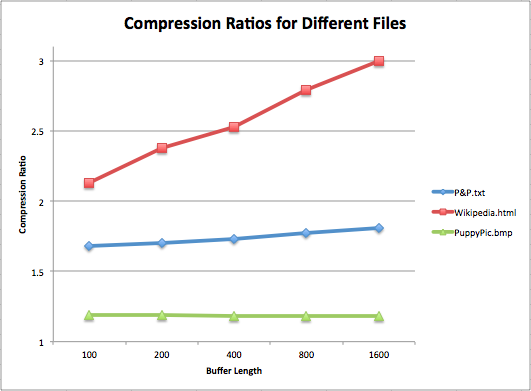

# Project 1 (Zip) Write-Up #
--------

#### How Was Your Partnership? ####
-   Did both partners do an equal amount of work?  If not, why not?
    If so, what did each person do? What happened?<pre>
Yes, we split up the work pretty well. Separately, Alia wrote ListFIFOQueue and
MinFourHeap and Anupam wrote ArrayStack and CircularArrayFIFOQueue. Then, we
debugged them together. We wrote HashTrieMap together, and took turns debugging 
each of the data structures until we found why Zip wasn't working. Alia is in
charge of the writeup, and Anupam is in charge of optimization of the data
structures and writing SuffixTrie, if we have time.
</pre> 

-----

#### Project Enjoyment ####
-   What was your favorite part of the project?  What was your least
    favorite part of the project?<pre>
Our favorite part was finding the bug in CircularArrayFIFOQueue that was messing
up Zip, and fixing it, and then finally having Zip work just as it should. It 
took us forever to find it, and it was just a tiny mistake, so debugging to find
it was our least favorite part. But, the struggle made fixing it all the more 
rewarding.
</pre> 

-   Did you enjoy the project?  Why or why not?<pre>
Yes, we both enjoyed it. We feel that it was a good refresher for the skills we 
learned in 143, and it shed light on how these important data structures actually
work. Plus, combining them all to get Zip to work was pretty satisfying.
</pre> 

-----

#### WorkLists, Tries, and Zip ####
-   The ADT for a WorkList explicitly forbids access to the middle elements.  However, the FixedSizeFIFOWorkList has a peek(i) method
    which allows you to do exactly that.  Why is this an acceptable addition to the WorkList ADT in this particular case but not in general?  
    In other words, what about fixed size FIFO worklists makes peek(i) make sense?<pre>
In the case where the client knows beforehand that they want a fixed capacity on
their FIFO worklist, it's alright for them to have the ability to look at items
in the middle because this action makes sense with the fixed size and FIFO
restrictions. Because this worklist is well-ordered, requesting the ith element
makes sense as an operation. In this context, because the size is fixed, knowing
the ith element can be helpful/useful because we can know how each element is
oriented in relation to the capacity. Indexing is easier when the list is
guaranteed to have a specific maximum size. Operations on such a list will
be efficient enough to allow for peeking at elements in the middle.
</pre> 
-   As we've described it, a `TrieMap` seems like a general-purpose replacement for `HashMap` or `TreeMap`.  Why might we still want to use one
    of these other data structures instead?<pre>
A TrieMap is great for storing similar pieces of data (like data with matching
prefixes) because it saves of storage space compared to HashMaps and TreeMaps.
So, TrieMaps are a good choice for similar data sets when we want to have good
space utilization. But, if we really value speed, a HashMap is the ideal choice,
because operations on HashMaps are for the most part faster than those on
TrieMaps and TreeMaps. If we want to be able to work with our data in an ordered
manner, TreeMaps are superior to HashMaps and TrieMaps, because they store the
data in sorted order. So, depending on the situation, a HashMap or TreeMap might
be a better choice than a TrieMap. Being different data structures, they come
with different advantages.
</pre> 
-   One of the applications of Tries is in solving Word Searches.  A "word search" is an n x m rectangle of letters.  The goal is to find all
    of the possible words (horizontal, vertical, diagonal, etc.).  In Boggle, a similar game, any consecutive chain of letters
    are allowed.  Explain (in very high-level psuedo-code) how you might solve this problem with a TrieSet or a TrieMap.  Make sure to detail
    how a similar solution that uses a HashSet/HashMap instead would be different and why using a Trie might make the solution better.<pre>
One way to solve this problem is to build up a TrieMap by iterating over each
letter in the n x m rectangle, and for each letter we map in the TrieMap all
sequences of letters we can build up for as far as we can go in each valid 
direction from the current letter. (Once there are no more valid directions to
go in a certain letter sequence buildup, we abandon the sequence and start back
from the current letter being considered, building a new sequence from there in
the next valid direction). Each time a new letter is added to the key sequence
being built up, if there is not already a value in the TrieMap for the current
key being considered, we perform a check based on a dictionary reference to see
if the current sequence of letters represents a valid word. If it is a valid
word, we add a non-null value as the value for the current key and print the
valid word. Once we have looked at all possible letter sequences in all possible
valid search directions from the current starting letter, we move to the next
letter and do the same thing. We do this until all n x m letters have been
considered as the starting letter and have had all their possible sequences
mapped. Thus, all valid words in this rectangle of letters (formed according to
the specific game's rules) are printed once.
</pre> 
<pre>
If we were to use a HashMap instead, this would not work as well, because our
data set here consists of many similar sequences of potential words and HashMaps
do not take advantage of this. Thus, a HashMap would take up more storage space
than a TrieMap. In addition, there may be enough hashing collisions with this
data in a HashMap to make looking up values less efficient than in a TrieMap,
where lookup time for a value is at worst the number of letters in the key. So,
in this situation, with this data, a TrieMap is the better choice due to its
more efficient storage of data with similar prefixes.
</pre> 
-   One of the classes in the main package is called Zip.  This class uses your PriorityQueue to do Huffman coding, your FIFOQueue as a buffer,
    your stack to calculate the keyset of a trie (using recursive backtracking), and your SuffixTrie to do LZ77Compression.  Find some text file
    (a free book from https://www.gutenberg.org/ or even the HTML of some website) and use Zip.java to zip it into a zip file.  Then, use a 
    standard zip utility on your machine (Finder on OS X, zip on Linux, WinZip or the like on Windows) to UNZIP your file.  Check that you got back
    the original.  Congratulations!  Your program correctly implements the same compression algorithm you have been using for years!  Discuss in a
    sentence or two how good the compression was and why you think it was good or bad.<pre>
We zipped and unzipped a .txt file of Pride and Prejudice, which is 718 KB. With
our version of zip, it got down to 422 KB with a buffer length of 200. Then, for
comparison, we zipped PrideandPrejudice.txt using the zip command on attu, and
that zip file is 260 KB. So, although it works, we don't think our compression
is all that great. We only got it down to 59% of the original size, whereas the
command line zip utility was able to get it down to 36% of the original size 
(and it did it much more quickly to boot).
</pre> 
-   Now that you've played with Zip, we want you to do an **experiment** with Zip.  Notice that there is a constant called `BUFFER_LENGTH` in `Zip.java`.
    Higher values of this constant makes the compression algorithm that Zip uses use more memory and consequently more time.  The "compression ratio"
    of a file is the uncompressed size divided by the compressed size.  Compare time, type of input file, and compression ratio by running
    your code on various inputs.  We would like an in-depth analysis.  You should try at least one "book-like" file, at least one "website-like" file,
    and some other input of your choice.  We expect you to draw meaningful conclusions and possibly have graphs that convince us of your conclusions.
    This single question is worth almost as much as the implementation of `ArrayStack`; so, please take it seriously.  If you spend less than 20 minutes
    on this question, there is no conceivable way that you answered this question in the way we were intending.<pre>
 

</pre> 
<pre>
We tried Zip on several different files with a buffer of 200, just to see what
compresses well. One of the first we tried was a .htm file of War and Peace,
which was irksome because it took 757.77 seconds to compress. (But at least the
file shrunk from 4.1 MB to 2.2 MB). Both Pride and Prejudice (as a .txt) and the
html for the main page of Wikipedia compressed faster than that. We tried
compressing the spec, just for fun, but it took 59.83 seconds to compress and
stayed the exact same size. We also tried to compress a picture of a puppy, but
the .jpg file stayed the same size, just like the .pdf of the spec. Then, we
converted the puppy picture to a .bmp file, and the file got bigger (the .jpg
was 46 KB and the .bmp was 779 KB, even though it was the same picture) but
then, when we compressed the .bmp, the zip file was actually smaller.
</pre> 
<pre>
Then, we decided to try three of the different files (Pride&Prejudice.txt,
Wikipedia.html, and PuppyPic.bmp) with different buffer lengths to compare their
compression performance. Our results are shown in the graphs above. Both P&P.txt
and Wikipedia.html behaved as we expected, with compression ratio and time taken
to compress increasing over time. Even though Wikipedia.html's time to compress\
wasn't increasing as rapidly as P&P.txt's, it makes sense, because
Wikipedia.html is 81 KB and P&P.txt is 718 KB. The thing that surprised us was
PuppyPic.bmp's performance. It took a much longer time to compress as the buffer
size increased, but the compression ratio didn't increase. So, we then wondered
if every .bmp file behaves like this, and tried it with two more .bmp pictures
(a kitten and a dragon). 
</pre> 
<pre>
 

</pre> 
<pre>
The .jpg files started out as 22 KB and 38 KB respectively for the kitten and
dragon. We converted them, and as .bmp files they are 239 KB and 360 KB. The
kitten and dragon .bmp files behaved much the same as the puppy .bmp, as the
graphs show. They all had the same phenomenon where they started out as a
smaller jpg, and then as a .bmp they are compressed to a specific size that
isn't nearly as small as the original jpg, but at least it's smaller than the
uncompressed .bmp. Despite the fact that the compression ratio stayed pretty
much the same, compression took much longer for higher buffer lengths. (How much
longer seemed to coincide with the size of the file). So, we surmise that,
despite the fact that .bmp files will actually compress where .jpg and .pdf
files won't, there is still a rather specific limit to how much they will
compress, no matter what the buffer length is. It didn't seem like this limit
existed for the non-picture files we compressed. Interesting.
</pre> 

#### Above and Beyond ####
-   Did you do any Above and Beyond?  Describe exactly what you
    implemented.<pre>
Alas, we didn't have time to do any of the Above and Beyond stuff.
</pre> 
